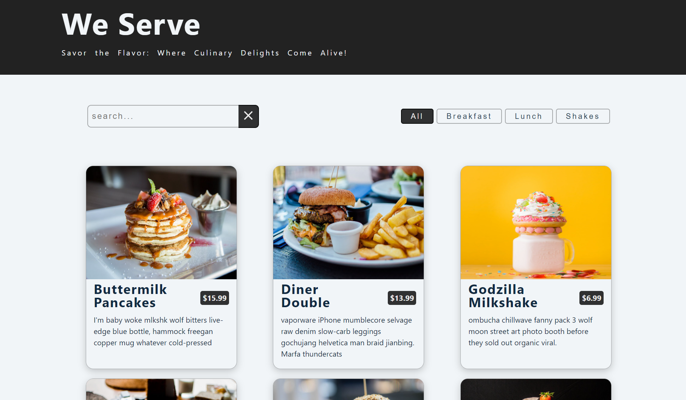

<div align="center">
  <h1> Menu-site </h1>
  

A sleek and user-friendly menu website built using HTML, CSS, JavaScript, and React. The website displays a menu with a convenient grid, allowing users to easily browse and search for items. 
</div>

## Features

- Responsive and intuitive user interface.
- Grid layout for visually appealing menu display.
- Sorting and searching functionality for convenient navigation.
- Built with React for efficient component-based development.

## Live Demo

Check out the live demo of the Menu React website [here](https://we-serve-react.netlify.app/).

## Installation

To run the Menu React project locally, follow these steps:

1. Clone the repository:

```shell
git clone https://github.com/Meenakshi-Sivakumar/menu-react.git 
```

2. Navigate to the project directory:

```shell
cd menu-react
```


3. Open the `index.html` file in your preferred web browser.

## Usage

1. Once the website is loaded, you will see the menu displayed in an user-centered design using a grid layout.
2. You can browse the menu items by scrolling through the page.
3. To sort the menu items, use the provided sorting button to select your preferred sorting option.
4. To search for specific items, use the search bar and enter the keyword. The menu will automatically update to show the matching items.

## Contributing

Contributions are welcome! If you would like to contribute to the Menu React project, please follow these steps:

1. Fork the repository.
2. Create a new branch for your feature or bug fix.
3. Make your changes and commit them with descriptive commit messages.
4. Push your changes to your forked repository.
5. Submit a pull request to the main repository.

